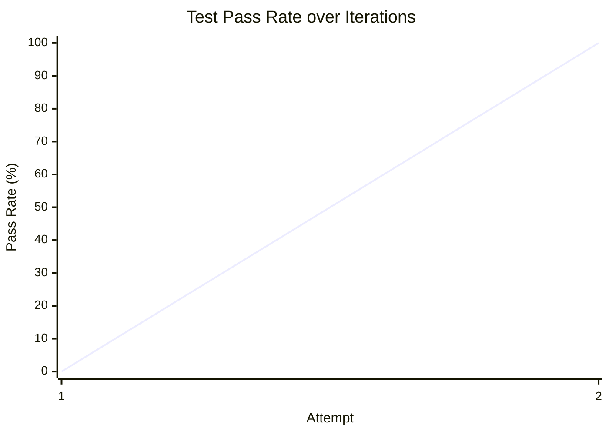

# Test Performance Report

This report visualizes the iterations required to achieve a 100% test pass rate for the Subtitle QC System.

```mermaid
xychart-beta
    title "Test Pass Rate over Iterations"
    x-axis "Attempt" [1, 2]
    y-axis "Pass Rate (%)" 0 --> 100
    line [0, 100]
```
